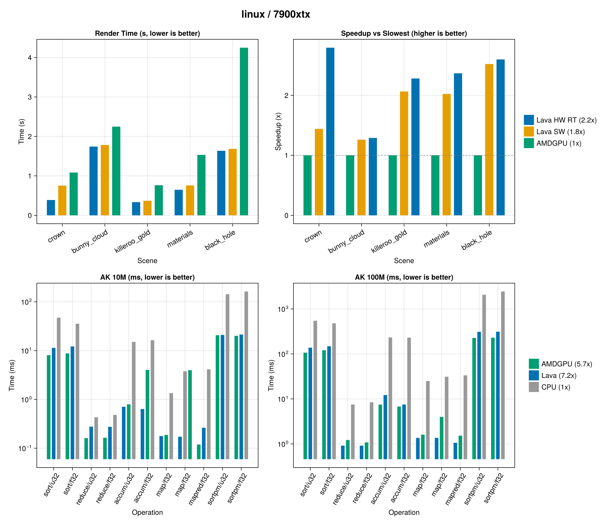
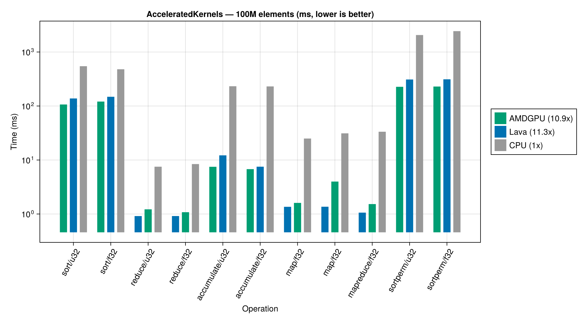
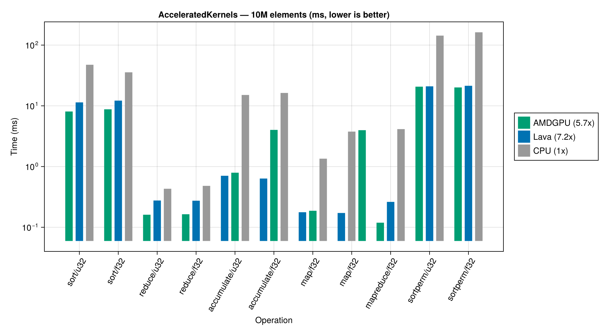

# Lava.jl

[](https://github.com/SimonDanisch/Lava.jl/actions/workflows/ci.yml)
[](https://SimonDanisch.github.io/Lava.jl/dev/)
[](LICENSE)

A Julia GPU backend that compiles Julia code to SPIR-V, targeting Vulkan. Lava.jl is three things at once:

1. **A compute GPU backend** with full GPUArrays.jl + KernelAbstractions.jl interface. Set `device = LavaBackend()` and any KA-based GPU code runs on Vulkan.

2. **A graphics shader backend** where vertex, fragment, geometry, and tessellation shaders are written in Julia (not GLSL). Pass regular Julia functions to `Rasterizer(vertex=f, fragment=g)`.

3. **A hardware-accelerated ray tracing backend** with raygen, closest-hit, any-hit, miss, intersection shaders using `VK_KHR_ray_tracing_pipeline`. Julia functions compile to RT shader stages with real hardware BVH traversal.

**Unified buffer model**: A single `LavaArray{T,N}` is usable across all shader stages. Compute kernels fill geometry, vertex shaders render it, ray tracing shaders trace against it. No copies, no format conversion.

Cross-platform: NVIDIA, AMD, Intel, Apple (MoltenVK), software (lavapipe).

## Installation

```julia
import Pkg
Pkg.add(url="https://github.com/SimonDanisch/Lava.jl")
```

Lava is not yet in the general registry. Once tagged it will be installable via `Pkg.add("Lava")`.

Requires:

- Julia ≥ 1.12 (set by Raycore's hard dep on 1.12; Lava itself runs on 1.11, but its required Raycore dep does not)
- A Vulkan 1.2+ driver with `bufferDeviceAddress` and `variablePointers` (any recent NVIDIA, AMD, Intel, MoltenVK, or lavapipe ≥ 24.x)
- For graphics: an X11/Wayland display, GLFW dev libs (`xorg-dev libxrandr-dev libxinerama-dev libxcursor-dev libxi-dev libxext-dev` on Debian-likes)

Verify your setup:

```julia
using Lava
Lava.vk_context()        # prints device, queue family, RT capabilities
```

## API Stability

The **KernelAbstractions.jl / GPUArrays.jl interface** (`LavaBackend`, `LavaArray`, `@kernel`, broadcasting, reductions) is considered stable. This is the standard Julia GPU ecosystem API and behaves like any other backend.

The **graphics** and **ray tracing** APIs (`Rasterizer`, `GraphicsPipeline`, `RayTracingPipeline`, `HardwareAccel`, etc.) are functional but still evolving. Expect breaking changes as we iterate on the design.

## Quick Start

```julia
using Lava, KernelAbstractions

# Compute: drop-in replacement for CUDABackend() or ROCBackend()
backend = LavaBackend()

@kernel function vadd!(C, A, B)
    i = @index(Global)
    C[i] = A[i] + B[i]
end

a = LavaArray(rand(Float32, 1024))
b = LavaArray(rand(Float32, 1024))
c = LavaArray{Float32}(undef, 1024)

vadd!(backend)(c, a, b; ndrange=1024)
@assert Array(c) ≈ Array(a) .+ Array(b)
```

```julia
# Graphics: Julia functions as shaders, no GLSL
pipeline = Rasterizer(
    vertex   = (pos, mvp) -> set_position!(mvp * pos),
    fragment = (color,)   -> color,
)
draw!(pipeline, framebuffer; vertices=mesh, uniforms=params)
```

```julia
# Hardware Ray Tracing: Julia-side TLAS with mesh-update support
using Raycore: RTRay, RTHitResult
using GeometryBasics, StaticArrays, LinearAlgebra

hwtlas = HWTLAS(LavaBackend())
push!(hwtlas, mesh, SMatrix{4,4,Float32}(I); instance_id=UInt32(1))
Raycore.sync!(hwtlas)

rays = LavaArray([RTRay(0,0,5, 0, 0,0,-1, 1f3)])
hits = LavaArray(fill(RTHitResult(0,0,0,0,0,0,0,0), 1))
trace_closest_hits!(hits, rays, hwtlas.hw_accel, 1)
```

`HWTLAS` is the recommended high-level entry point. It owns the Vulkan TLAS
+ BLAS lifecycle, supports incremental geometry updates via `push!` /
`delete!` / `update_transform!`, and implements the `Raycore.AbstractAccel`
contract so the same code works against software and hardware backends.
`HardwareAccel` remains available as a lower-level handle for advanced
users who need direct control of the pipeline/SBT.

## Benchmarks — AMD RX 7900 XTX

Render benchmarks using [Hikari](https://github.com/SimonDanisch/Hikari.jl) wavefront volume path tracer via [RayMakie](https://github.com/SimonDanisch/RayMakie.jl), and [AcceleratedKernels.jl](https://github.com/JuliaGPU/AcceleratedKernels.jl) compute benchmarks. AMD RX 7900 XTX / Ryzen 9 7900X. Full benchmark suite in [RayDemo](https://github.com/SimonDanisch/RayDemo).

### Ray Tracing (Hikari scenes)



Lava SW is **1.4-2.5x faster than AMDGPU** across all scenes. Hardware RT adds another **1.0-2.3x** on geometry-heavy scenes (Crown, Killeroo Gold). Compared to pbrt-v4 on 24 CPU threads: **5-32x faster**.

### AcceleratedKernels — 100M elements



### AcceleratedKernels — 10M elements



Lava wins on compute-bound and dispatch-sensitive operations (up to **23x faster** on map/sin at 10M). AMDGPU wins on memory-bound operations (sort, sortperm) where its native HIP driver has an edge.


## Architecture

Lava.jl uses a **custom LLVM IR to SPIR-V emitter written in Julia** (~6,000 lines). This is not a wrapper around `llc` or the SPIRV-LLVM-Translator. It reads the LLVM module via LLVM.jl and emits SPIR-V directly, giving full control over all shader stages and Vulkan extensions.

```
Julia function
  |  GPUCompiler.jl
LLVM IR (via LLVM.jl, LLVM 18)
  |  LLVM passes: GEP lifting, StructurizeCFG, Vulkan preparation
  |  Custom SPIR-V emitter (~40 LLVM opcodes to SPIR-V)
  |  spirv-val validation
VkShaderModule -> VkPipeline -> GPU dispatch
```

**Why not llc?** The LLVM SPIR-V backend crashes on geometry shaders, rejects ray tracing extensions, and doesn't support key Vulkan extensions (`SPV_KHR_physical_storage_buffer`, `SPV_KHR_variable_pointers`). These are missing C++ instruction selection patterns with no upstream fix planned. The custom emitter handles all shader stages from day one.

## Features

### Compute
- **GPUArrays.jl**: ~99.9% test suite pass (9,578 passed, 26 failed across 27 groups)
- **KernelAbstractions.jl**: Full `LavaBackend <: KA.GPU` with `@kernel`, `@index`, `@localmem`, `@synchronize`
- **Atomix.jl**: Int32/UInt32/Float32 atomics (add, sub, and, or, xor, xchg, min, max; Float32 add via CAS loop)
- **Complex structs**: Deeply nested types, NTuple fields, multi-field structs pass through BDA without corruption
- **Hikari raytracer**: Full wavefront volume path tracer (93 source files, 20 materials, 6+ kernel stages) renders correctly

### Graphics
- Vertex, fragment, geometry, tessellation shaders from plain Julia functions
- `Rasterizer`, `TrianglePipeline`, `LinePipeline` high-level APIs
- `RenderWindow` with GLFW + swapchain, `LavaFramebuffer` for offscreen
- `LavaTexture2D`, `LavaSampler` with descriptor set management
- Blend modes, culling, depth testing, topology selection

### Ray Tracing
- `VK_KHR_ray_tracing_pipeline` + `VK_KHR_acceleration_structure`
- BLAS/TLAS build from triangle meshes
- `RayTracingPipeline(raygen=f, closest_hit=g, miss=h)` with Julia functions as RT shaders
- `HardwareAccel` integration with Hikari/Raycore for drop-in HW RT
- Multi-field payloads, any-hit shaders for alpha transparency
- Shadow rays with multi-round host dispatch

### Performance
- **Dispatch overhead**: 1.8us per dispatch (vs AMDGPU 8.8us), 11x improvement via `@generated` arg packing, pipeline cache, ghost type optimization
- **Throughput**: 2x faster than AMDGPU on single-dispatch 10M-element kernels
- **Hikari 10spp 1200x900**: ~1.42s (vs AMDGPU ~1.69s, 16% faster)
- **Batched dispatch**: Multiple kernels recorded into a single command buffer, submitted together
- **Unified/BAR memory**: Auto-detected for small buffers, eliminates staging copies

### Kernel Arguments: Buffer Device Address (BDA)
All kernel arguments are packed into a device-memory buffer with a single `i64` push constant pointing to the BDA. No descriptor sets per buffer, no 256-byte push constant limit. One push constant, unlimited arguments.

## Source Structure

```
src/
├── Lava.jl                          # Module, exports, debugging API
├── compiler/
│   ├── compilation.jl               # Pipeline orchestration, LLVM pass coordination
│   ├── target.jl                    # GPUCompiler target (LavaCompilerTarget)
│   ├── entry_wrapper.jl             # BDA argument buffer wrapping
│   ├── passes/
│   │   ├── lift_geps.jl             # Byte-offset GEP to typed GEP (3 passes)
│   │   ├── structurize_cfg.jl       # CFG fixup + StructurizeCFGPass
│   │   ├── prepare_vulkan.jl        # 8 Vulkan IR transforms, shared mem flattening
│   │   └── lower_intrinsics.jl      # Math/barrier/thread-index lowering
│   └── spirv/
│       ├── module.jl                # SPIR-V module builder, ID allocation, serialization
│       ├── types.jl                 # LLVM to SPIR-V type mapping, opaque pointer recovery
│       ├── emit.jl                  # Core emitter: ~40 opcodes, control flow, decorations
│       ├── graphics.jl              # Graphics shader entry points
│       └── raytracing.jl            # RT shader stages, OpTraceRayKHR
├── device/
│   ├── math.jl                      # Float32 GLSL.std.450 + Float64 fallbacks
│   ├── quirks.jl                    # @device_override for GPU-safe replacements
│   ├── atomics.jl                   # Atomix.jl integration, CAS loops
│   ├── rt_intrinsics.jl             # RT builtins (trace_ray, payload I/O)
│   └── gfx_intrinsics.jl            # Graphics builtins (vertex_index, frag_coord, etc.)
├── runtime/
│   ├── device.jl                    # Vulkan device/queue creation, feature detection
│   ├── memory.jl                    # Buffer allocation, BDA, staging, mapped memory
│   ├── command.jl                   # Command buffer pool, batched submission
│   ├── launch.jl                    # lava_launch!, arg buffer pool, vk_flush!
│   ├── pipeline.jl                  # VkShaderModule + pipeline caching
│   ├── errors.jl                    # LavaError, validation layer capture
│   └── intrinsics.jl                # Runtime intrinsic helpers
├── array/
│   ├── lavaarray.jl                 # LavaArray{T,N} + LavaDeviceArray
│   ├── gpuarrays.jl                 # GPUArrays.jl interface, BroadcastStyle
│   ├── ka_backend.jl                # KA LavaBackend, @kernel/@index/@localmem
│   └── mapreduce.jl                 # GPU mapreducedim! with subgroup reductions
├── graphics/
│   ├── types.jl                     # BlendMode, CullFace, Topology, DepthMode, etc.
│   ├── api.jl                       # GraphicsPipeline, draw!, blit!, present_frame!
│   ├── pipeline.jl                  # CompiledGraphicsPipeline, draw recording
│   ├── framebuffer.jl               # LavaFramebuffer, render targets
│   ├── window.jl                    # RenderWindow, swapchain, GLFW
│   └── textures.jl                  # LavaTexture2D, LavaSampler
└── raytracing/
    ├── acceleration.jl              # BLAS/TLAS build, HardwareAccel
    ├── pipeline.jl                  # RT pipeline, SBT, vkCmdTraceRaysKHR
    ├── shaders.jl                   # RayTracingPipeline high-level API
    └── raycore_compat.jl            # trace_closest_hits!, Hikari integration
```

## Dependencies

| Package | Role |
|---------|------|
| GPUCompiler.jl | Julia to LLVM IR compilation |
| LLVM.jl (v9.4, LLVM 18) | LLVM IR manipulation and passes |
| Vulkan.jl (v0.6) | Vulkan API bindings |
| GPUArrays.jl | AbstractGPUArray interface |
| KernelAbstractions.jl | Backend-agnostic kernel API |
| Adapt.jl | Host/device type conversion |
| Atomix.jl | Atomic operations |
| SPIRV_Tools_jll | spirv-val, spirv-dis |
| GeometryBasics.jl | Vec/Mat/Point types for geometry math |
| GLFW | Window creation for graphics |

## Hardware

Tested on:
- AMD RX 7900 XTX (Vulkan 1.4, RADV)
- NVIDIA RTX 3070 Laptop (Vulkan 1.3)
- lavapipe (software, CI)

Requires Vulkan 1.2+ with `bufferDeviceAddress` and `variablePointers` features.

## Test Suite

```
Total: 14,461 passed, 0 failed, 0 errors, 1 broken — 14m52s on RX 7900 XTX
```

Includes:

- 319 SPIR-V emission pattern checks
- Golden-file snapshots for every shader stage (re-bless with `LAVA_BLESS=1`)
- 415 GPU execution tests + 1,776 struct broadcast regressions
- 7,347-test [GPUArrays.jl](https://github.com/JuliaGPU/GPUArrays.jl) test suite, fully clean on this branch
- 1,342 NVIDIA regression + stress checks (compute & RT)
- HW TLAS stress / mesh update / UAF safety / non-blocking sync — 2,550 tests
- Phase-M alloc/dispatch/free loop matrix — 6 progressively-harder regressions, all clean

Run tests:

```julia
using Pkg; Pkg.test("Lava")
```

Headless CI uses `xvfb-run` — see [Installation](https://SimonDanisch.github.io/Lava.jl/dev/installation/) for the standard invocation.

## Debugging

```julia
using Lava

# Memory usage
gpu_memory_usage()  # -> (live_bytes=..., live_buffers=..., ...)

# Full runtime state
dump_state()

# Dispatch logging
set_dispatch_logging!(true)
# ... run kernels ...
get_dispatch_log()

# Reset device after error
vk_reset_device!()
```


## Documentation

- **[Dev docs](https://SimonDanisch.github.io/Lava.jl/dev/)** — full API reference, deeper guides for compute / graphics / ray tracing, plus design notes on the emitter and runtime.
- **[KNOWN_ISSUES.md](KNOWN_ISSUES.md)** — actively tracked driver bugs and limitations.
- **[RayDemo](https://github.com/SimonDanisch/RayDemo)** — end-to-end example scenes and benchmark scripts.

## Contributing

Bug reports and pull requests welcome. For driver-specific issues, please include `Lava.vk_context()` output and (where possible) a minimal reproducer using only `Lava` + `KernelAbstractions`. Test files in `test/mwe_*.jl` are the format we use.

## License

MIT. See [LICENSE](LICENSE).

## Status

The **KernelAbstractions / GPUArrays compute path** is feature-complete and runs the GPUArrays test suite at ~99.7 % pass. The **graphics** and **ray tracing** paths are functional and exercised by the same Hikari path tracer that drives the benchmarks above; their public APIs are still evolving. Multi-vendor CI (currently lavapipe; NVIDIA/AMD self-hosted runners planned), additional documentation, and continued performance work are ongoing.
